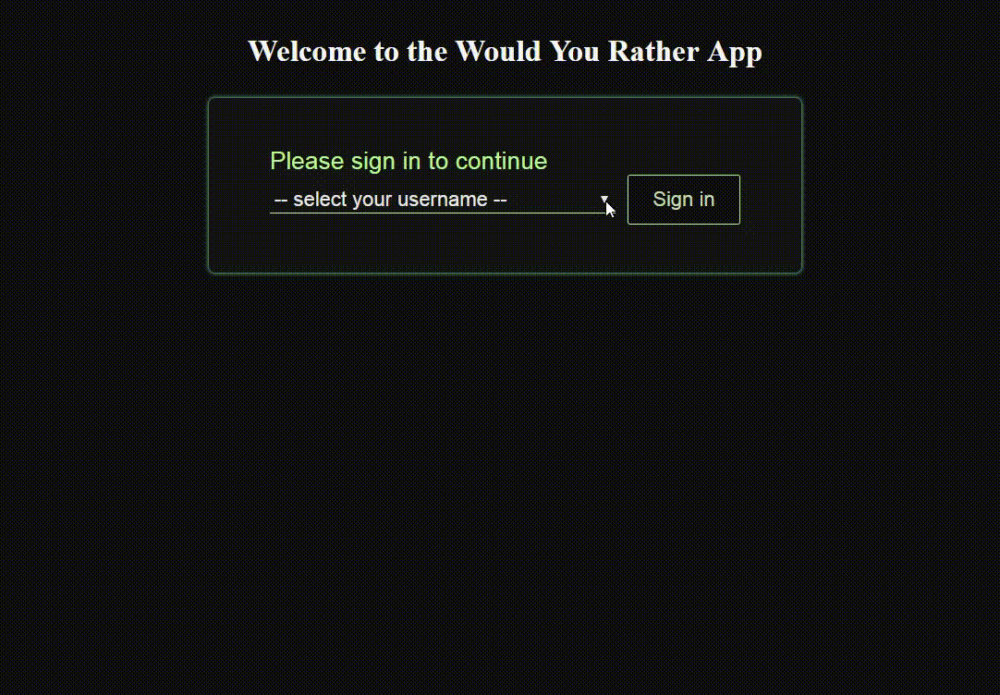

# Would You Rather...?
This application was built with React & Redux for Udacity course. The application is an imitation of 'Would you rather' game.
It allows a user to log in, answer questions, create his/her own questions, and see questions statistic.

## Installation
* git clone https://github.com/svlesiv/would-you-rather.git
* navigate to `would_you_rather` directory
* install all project dependencies with `npm install`
* start the development server with `npm start`
